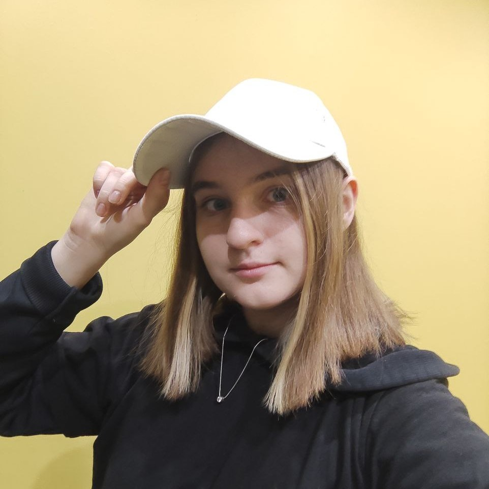

### Привет, я Тина ✨

Я начинающий разработчик. 
Стремлюсь к самосовершенствованию в сфере информационных технологий. Я студентка Высшего Колледжа Информатики Новосибирского Государственного Университета. 
Сейчас ппишу диплом по нейросетям и активно обучаюсь в Школе 21, преодолевая технические вызовы и разрабатывая инновационные проекты. Let's code the future together! 🚀

 

- 🎓 Высший колледж информатики (2020 - настоящее время)

- 🚀 Школа 21 (2022 - настоящее время)

- 🔍 Хочу освоить профессию и найти работу

- 📫 Как связаться со мной:  

---